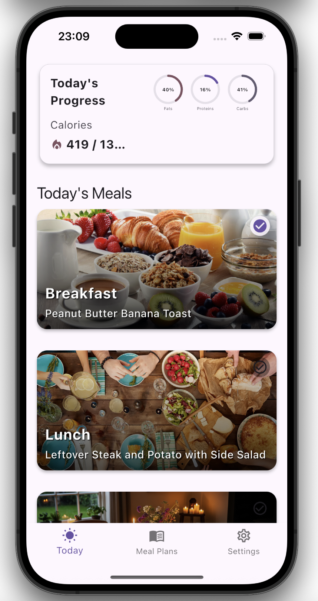
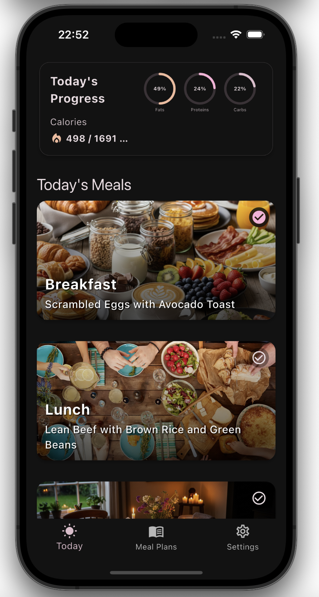
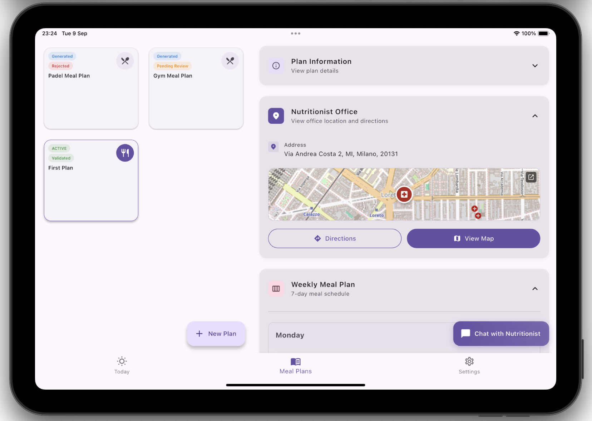

# WellPlate - AI-Powered Nutrition Management Platform

<div align="center">
  
  
  [](https://flutter.dev/)
  [](https://aws.amazon.com/)
  [](https://graphql.org/)
  [](https://www.typescriptlang.org/)
</div>

## 📱 Overview

**WellPlate** is a comprehensive nutrition management platform that connects users with professional nutritionists through AI-powered meal planning. The application leverages Google's Gemini AI to generate personalized meal plans while providing real-time communication channels between users and nutritionists for plan validation and customization.

### 🎯 Key Features

- **🤖 AI-Powered Meal Planning**: Generate personalized 7-day meal plans using Google Gemini AI
- **👨‍⚕️ Professional Validation**: Connect with certified nutritionists for plan review and approval
- **💬 Real-time Communication**: Built-in chat system for user-nutritionist collaboration
- **📊 Progress Tracking**: Monitor daily meal completion and nutritional goals
- **🌍 Multi-language Support**: Internationalization support for global accessibility
- **📱 Cross-Platform**: Native mobile apps for iOS, Android, and web platforms
- **🗺️ Location Services**: Find nearby nutritionists and set office locations
- **📈 Subscription Management**: Free and Pro tier support

## 🏗️ Architecture

### Frontend (Flutter)

- **Framework**: Flutter 3.0+ with Dart
- **State Management**: Riverpod for reactive state management
- **Local Storage**: Isar database for offline data persistence
- **UI Components**: Material Design with adaptive layouts for phones and tablets
- **Authentication**: AWS Amplify Cognito integration

### Backend (AWS Serverless)

- **API**: GraphQL with AWS AppSync
- **Database**: DynamoDB for data persistence
- **Compute**: AWS Lambda functions for business logic
- **AI Integration**: Google Gemini API for meal plan generation
- **Workflow**: AWS Step Functions for orchestration
- **Storage**: S3 for profile pictures and media
- **Infrastructure**: AWS CDK for Infrastructure as Code

### Key Services

- **Meal Plan Generation**: Step Functions workflow with Gemini AI
- **Real-time Notifications**: AppSync subscriptions
- **File Management**: S3 with presigned URLs
- **Authentication**: Cognito User Pools with role-based access

## 📱 Screenshots

<div align="center">
  <h3>Home Screen - Light Theme</h3>
  
  
  <h3>Home Screen - Dark Theme</h3>
  
  
  <h3>User Meal Plans Interface on Tablet</h3>
  
</div>

### Key Features Showcased

- **User Dashboard**: Clean, intuitive interface for meal planning
- **Theme Support**: Both light and dark mode available
- **Meal Plan Management**: Easy-to-use interface for viewing and managing meal plans
- **Progress Tracking**: Visual indicators for meal completion status

## 🚀 Getting Started

### Prerequisites

- **Flutter SDK** 3.0 or higher
- **Node.js** 18+ and npm
- **AWS CLI** configured with appropriate permissions
- **Dart SDK** 3.6.0 or higher
- **Git** for version control

### Installation

#### 1. Clone the Repository

```bash
git clone <repository-url>
cd DIMA-2024
```

#### 2. Backend Setup

```bash
cd backend
npm install
npm run build
npm run deploy
```

#### 3. Frontend Setup

```bash
cd frontend
flutter pub get
flutter pub run build_runner build
flutter gen-l10n
```

#### 4. Environment Configuration

- Copy `amplify_outputs.json` from backend to frontend root
- Configure AWS credentials
- Set up Google Gemini API key in AWS Secrets Manager

### Running the Application

#### Development Mode

```bash
# Backend (in backend directory)
npm run watch

# Frontend (in frontend directory)
flutter run
```

#### Production Build

```bash
# Android
flutter build apk --release

# iOS
flutter build ios --release

# Web
flutter build web --release
```

## 🔧 Development

### Project Structure

```
DIMA-2024/
├── backend/                 # AWS CDK Backend
│   ├── lib/                # CDK Stack definitions
│   ├── src/lambda/         # Lambda function implementations
│   ├── resolvers/          # GraphQL resolvers
│   ├── graphql/            # GraphQL schema
│   └── templates/          # VTL templates
├── frontend/               # Flutter Application
│   ├── lib/
│   │   ├── Views/          # UI screens and components
│   │   ├── models/         # Data models and Isar schemas
│   │   ├── services/       # API and business logic
│   │   └── providers/      # Riverpod state providers
│   ├── assets/             # Images and static resources
│   └── l10n/              # Internationalization files
└── deliverables/           # Documentation and presentations
```

### Key Technologies

#### Frontend

- **Flutter**: Cross-platform UI framework
- **Riverpod**: State management and dependency injection
- **Isar**: Local database for offline functionality
- **Amplify**: AWS integration and authentication
- **Material Design**: UI component library

#### Backend

- **AWS CDK**: Infrastructure as Code
- **AppSync**: GraphQL API with real-time subscriptions
- **DynamoDB**: NoSQL database
- **Lambda**: Serverless compute functions
- **Step Functions**: Workflow orchestration
- **Cognito**: User authentication and authorization

### Database Schema

The application uses DynamoDB with the following main entities:

- **MealPlan**: User meal plans with daily meal data
- **UserDetails**: User preferences and profile information
- **NutritionistProfile**: Professional nutritionist profiles
- **ChatMetadata**: Chat session management
- **ChatMessage**: Real-time messaging data
- **PlanDayCompletion**: Daily progress tracking

## 🔐 Authentication & Authorization

### User Roles

- **USERS**: Regular users who can create meal plans and chat with nutritionists
- **NUTRITIONISTS**: Professionals who can validate and modify meal plans

### Security Features

- JWT-based authentication via AWS Cognito
- Role-based access control (RBAC)
- API-level authorization with GraphQL directives
- Secure file uploads with presigned URLs

## 🌐 Internationalization

The application supports multiple languages through Flutter's internationalization system:

- English (default)
- Italian
- Additional languages can be added via ARB files

### Adding New Translations

```bash
# 1. Add strings to app_{locale}.arb files
# 2. Merge ARB files
python scripts/merge_arb.py

# 3. Generate localization classes
flutter gen-l10n
```

## 📊 AI Integration

### Meal Plan Generation

- **AI Model**: Google Gemini 2.5 Flash
- **Input**: User preferences, dietary restrictions, allergies
- **Output**: Structured 7-day meal plans with nutritional data
- **Validation**: Professional nutritionist review process

### Key Features

- Personalized macro and micronutrient calculations
- Allergy and dietary restriction compliance
- Multi-language recipe generation
- Realistic portion sizes and preparation instructions

## 🚀 Deployment

### Backend Deployment

```bash
cd backend
npm run deploy
```

### Frontend Deployment

```bash
# Android
flutter build apk --release
# Deploy to Google Play Store

# iOS
flutter build ios --release
# Deploy to App Store

# Web
flutter build web --release
# Deploy to AWS S3/CloudFront
```

## 📈 Performance

### Optimization Features

- **Offline Support**: Local data caching with Isar
- **Lazy Loading**: Efficient data pagination
- **Image Optimization**: Compressed assets and lazy loading
- **State Management**: Efficient re-rendering with Riverpod
- **API Optimization**: GraphQL query optimization

## 🤝 Contributing

1. Fork the repository
2. Create a feature branch (`git checkout -b feature/amazing-feature`)
3. Commit your changes (`git commit -m 'Add some amazing feature'`)
4. Push to the branch (`git push origin feature/amazing-feature`)
5. Open a Pull Request

### Development Guidelines

- Follow Flutter/Dart style guidelines
- Write comprehensive tests
- Update documentation for new features
- Use conventional commit messages

## 📄 License

This project is licensed under the MIT License - see the [LICENSE](LICENSE) file for details.

## 👥 Team

- Jacopo Piazzalunga[https://github.com/Jacopopiazza]
- Gabriele Puglisi[https://github.com/GabP404]
- Davide Salonico[https://github.com/DavideSalonico]
  
---

<div align="center">
  <p>Built with ❤️ using Flutter and AWS</p>
</div>
